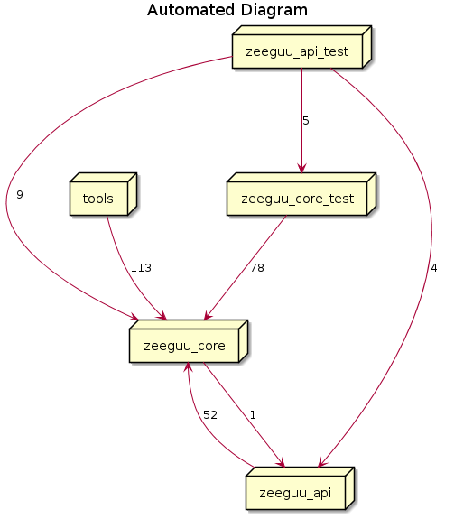

# An Architecture Reconstruction Project (AARP)

[](https://github.com/heyjoakim/AARP/actions/workflows/build.yml)
[](https://goreportcard.com/report/github.com/heyjoakim/AARP)


The goal of the project is to recover one or more architectural views and to present them in a brief report. The audience of the report is somebody who has not seen that system before and needs to get a high-level understanding of the system.


Target: [The Zeeguu-API](https://github.com/zeeguu-ecosystem/Zeeguu-API) (Python backend)

**Viewpoints**

- A module view describing the roles of both the modules and the dependencies in it


The idea of the project is to create models from pre-exisisting tools like plantUML. Using such tools enables the possibility to go and correct the diagram if needed.

```
@startuml
    title Automated Diagram
    skinparam nodesep 100
    skinparam ranksep 100
    node tools
    node zeeguu_core
    node zeeguu_api
    node zeeguu_api_test
    node zeeguu_core_test
    tools --> zeeguu_core
    zeeguu_api --> zeeguu_core
    zeeguu_api_test --> zeeguu_core
    zeeguu_api_test --> zeeguu_core_test
    zeeguu_api_test --> zeeguu_api
    zeeguu_core --> zeeguu_api
    zeeguu_core_test --> zeeguu_core
@enduml
```

End result would be something like the following: 

